# Vehicle wheel models

Mafia II vehicles can replace the model used by each wheel group. The M2O scripting API identifies each available wheel model by its exact name.

Wheel model changes are authoritative server operations. M2O stores the selected model on the vehicle and replicates it to connected players, including players who stream the vehicle in later.

## Changing wheels on the server

Call `Vehicle.setWheelModel(group, modelName)` from a server resource. Group `0` controls the front axle, group `1` controls the rear axle, and group `2` controls the spare wheel.

```js
Events.on("playerCommand", (player, command) => {
  if (command !== "sportwheels") return;

  const vehicle = player.getVehicle();
  if (!vehicle) {
    Chat.sendToPlayer(player, "Enter a vehicle first.");
    return;
  }

  vehicle.setWheelModel(0, "wheel_sport"); // Front axle
  vehicle.setWheelModel(1, "wheel_sport"); // Rear axle
});
```

Pass an empty model name to restore the vehicle's default wheel for that group. `Vehicle.getWheelModel(group)` returns the stored override. Wheel damage is separate: use `Vehicle.setWheelState(index, VehicleWheelState.Deflated)` or `VehicleWheelState.BlownOut` when changing tyre condition.

## Available wheel models

| Model name | Preview |
|:-----------|:--------|
| `wheel_civ01` |  |
| `wheel_civ02` | 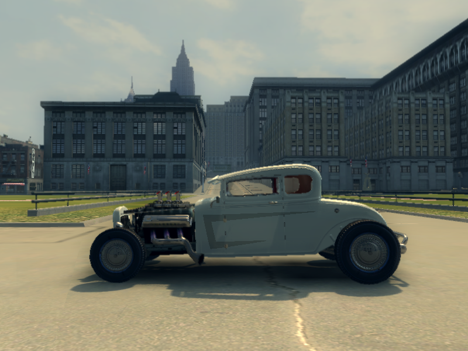 |
| `wheel_civ03` |  |
| `wheel_civ04` | 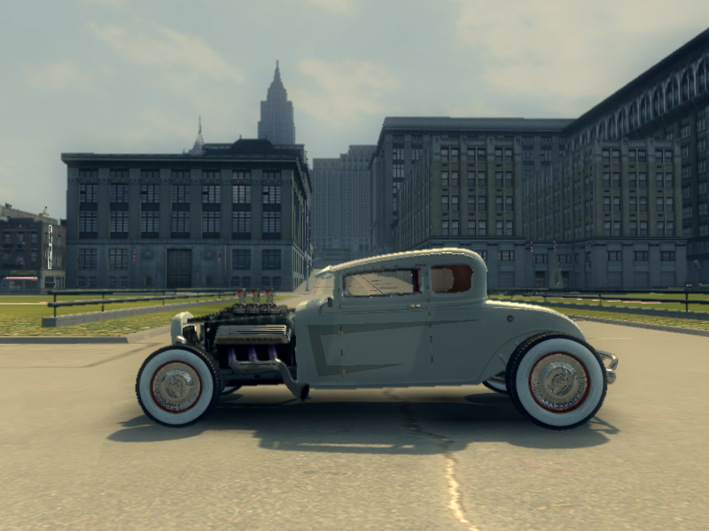 |
| `wheel_civ05` | 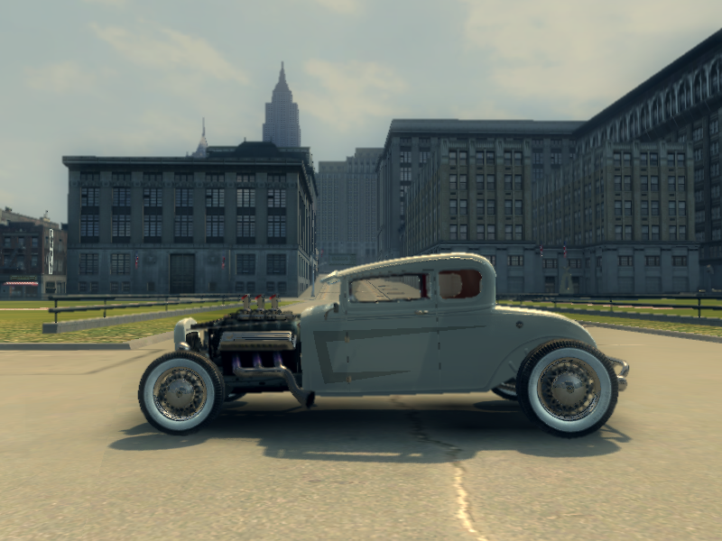 |
| `wheel_civ06` | 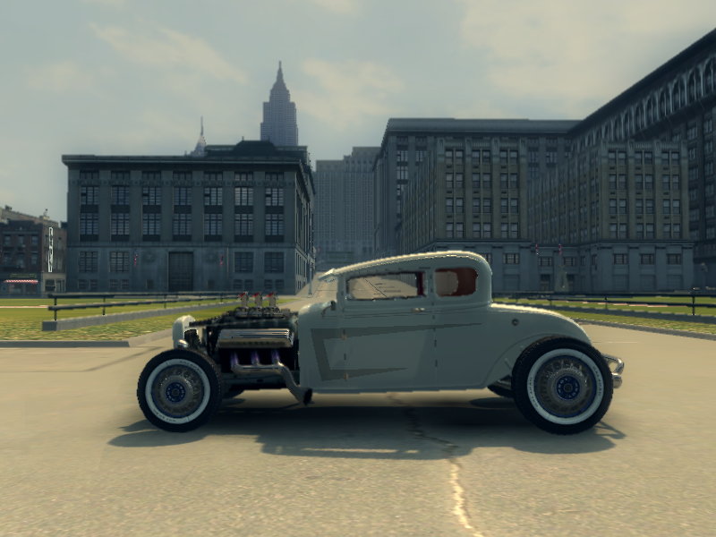 |
| `wheel_civ07` |  |
| `wheel_civ08` | 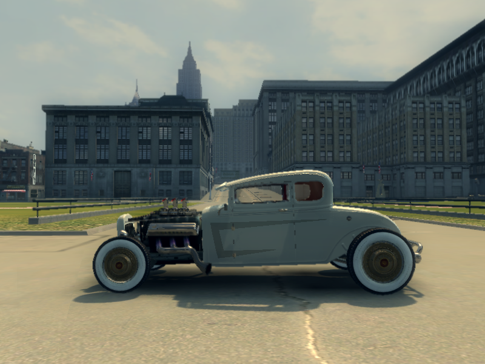 |
| `wheel_civ09` | 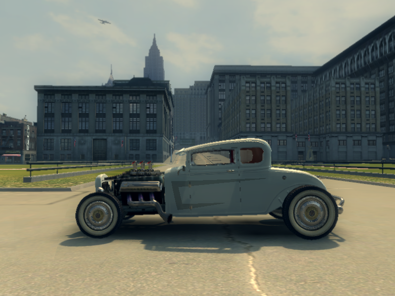 |
| `wheel_civ10` |  |
| `wheel_civ11` | 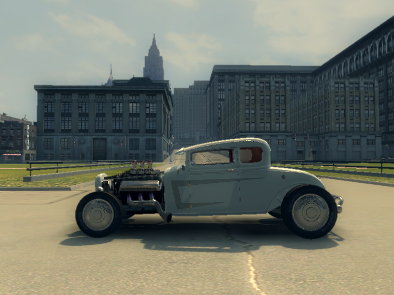 |
| `wheel_civ09_hot` | 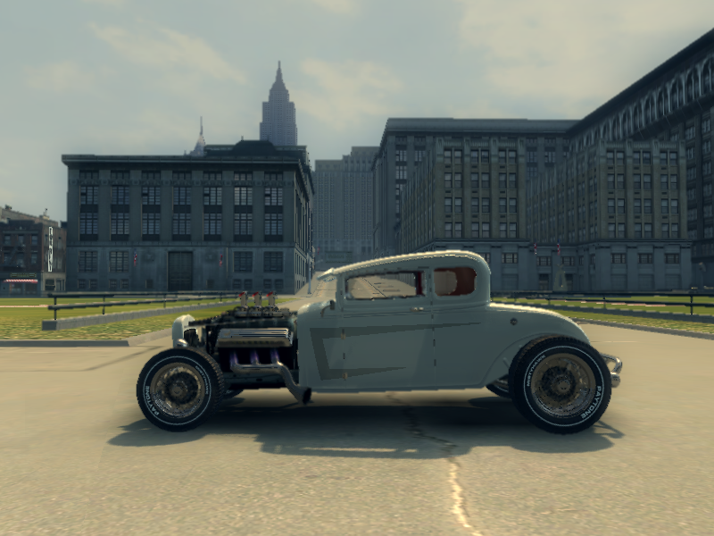 |
| `wheel_civ11_hot` | 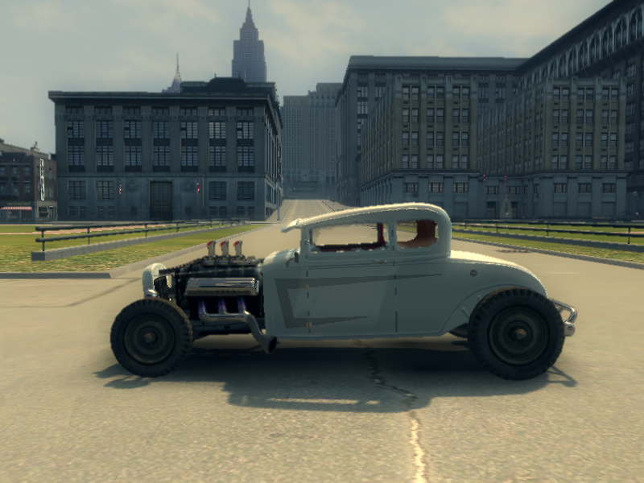 |
| `wheel_sport` | 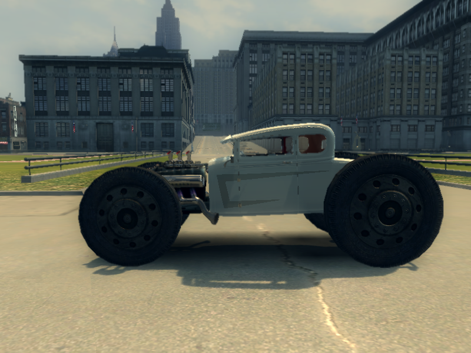 |
| `wheel_jeep` | 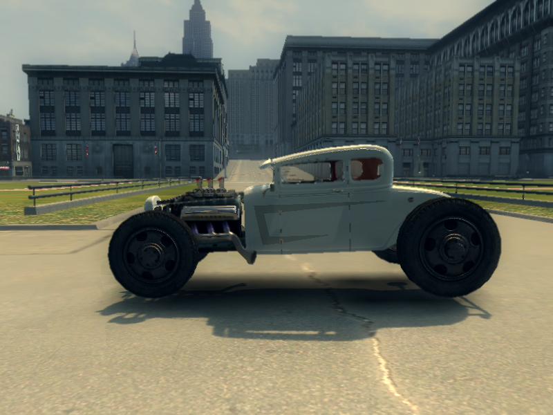 |
| `wheel_hank_f` | 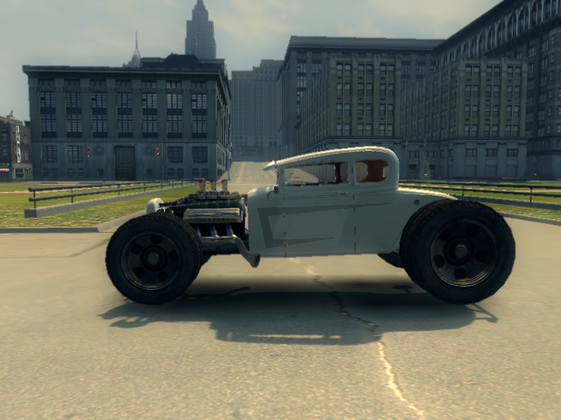 |
| `wheel_hank_r` | 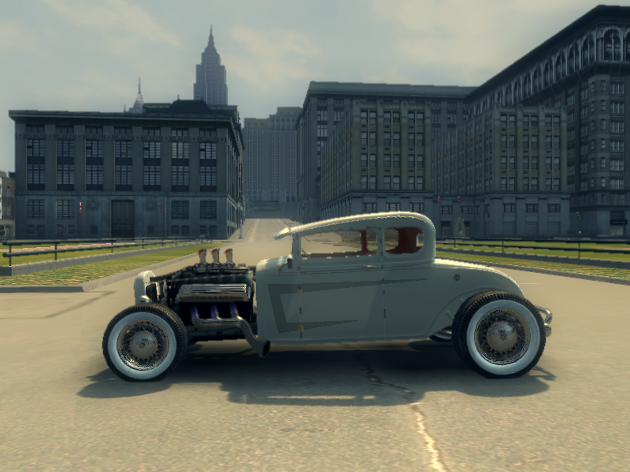 |
| `wheel_truckciv01` | 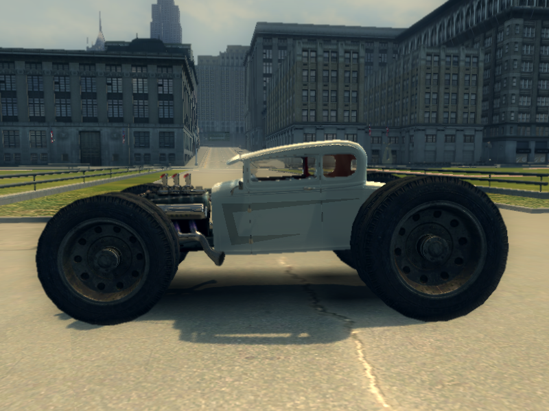 |
| `wheel_truckciv02` | 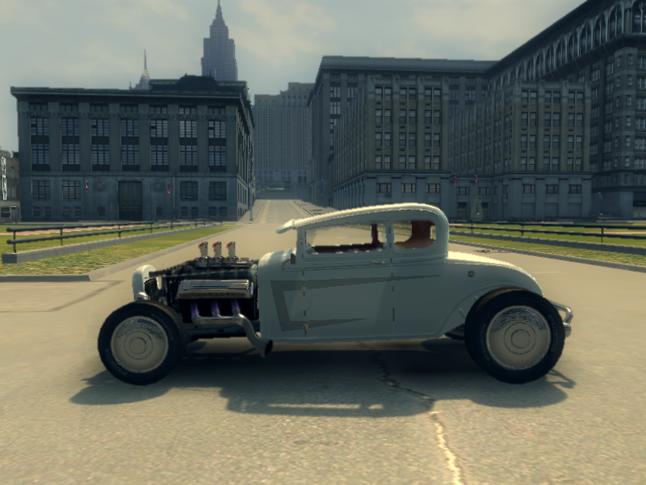 |
