# Weapon IDs

Weapons in the scripting API are identified by their numeric `weapons.tbl` row ID. Use the table below when granting a weapon, changing ammunition, equipping a weapon, or checking which weapon a player currently holds.

Weapon inventory changes are authoritative server operations. The server sends the requested change to the owning client, while normal M2O player synchronization makes the equipped weapon visible to other players.

## Granting a weapon on the server

Call `Player.giveWeapon(weaponId, ammo, equip)` from a server resource:

```js
Events.on("playerConnect", (player) => {
  const weaponId = 10; // MP40
  const reserveAmmo = 120;

  player.giveWeapon(weaponId, reserveAmmo, true);
});
```

The first argument is an ID from this page, the second is the initial reserve ammunition, and the final boolean controls whether the granted weapon is equipped immediately. An ammunition value of zero or less uses the default load of 100 rounds. Unknown weapon IDs are ignored.

Use `player.giveAmmo(weaponId, amount)` to adjust reserve ammunition later, or `player.removeWeapon(weaponId)` to remove the weapon from the player's inventory.

## Available weapons

Some IDs represent incomplete or unsafe game content. Pay attention to the notes beside grenades, the MG42, and the missing sniper model before exposing them in a game mode.

<div class="mh-weapon-grid">
  <article class="mh-weapon-card">
    <div class="mh-weapon-card__meta"><span>#02</span><span>Sidearm</span></div>
    <div class="mh-weapon-card__art">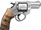</div>
    <h3>Model 12 Revolver</h3>
  </article>
  <article class="mh-weapon-card">
    <div class="mh-weapon-card__meta"><span>#03</span><span>Sidearm</span></div>
    <div class="mh-weapon-card__art">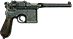</div>
    <h3>Mauser C96</h3>
  </article>
  <article class="mh-weapon-card">
    <div class="mh-weapon-card__meta"><span>#04</span><span>Sidearm</span></div>
    <div class="mh-weapon-card__art">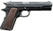</div>
    <h3>Colt M1911A1</h3>
  </article>
  <article class="mh-weapon-card">
    <div class="mh-weapon-card__meta"><span>#05</span><span>Sidearm</span></div>
    <div class="mh-weapon-card__art">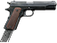</div>
    <h3>Colt M1911 Special</h3>
  </article>
  <article class="mh-weapon-card">
    <div class="mh-weapon-card__meta"><span>#06</span><span>Sidearm</span></div>
    <div class="mh-weapon-card__art">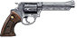</div>
    <h3>Model 19 Revolver</h3>
  </article>
  <article class="mh-weapon-card mh-weapon-card--warning">
    <div class="mh-weapon-card__meta"><span>#07</span><span>Inactive</span></div>
    <div class="mh-weapon-card__art">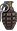</div>
    <h3>Grenade Sicily</h3><p>Does not explode.</p>
  </article>
  <article class="mh-weapon-card">
    <div class="mh-weapon-card__meta"><span>#08</span><span>Shotgun</span></div>
    <div class="mh-weapon-card__art">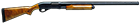</div>
    <h3>Remington 870 Field Gun</h3>
  </article>
  <article class="mh-weapon-card">
    <div class="mh-weapon-card__meta"><span>#09</span><span>SMG</span></div>
    <div class="mh-weapon-card__art">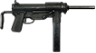</div>
    <h3>M3 Grease Gun</h3>
  </article>
  <article class="mh-weapon-card">
    <div class="mh-weapon-card__meta"><span>#10</span><span>SMG</span></div>
    <div class="mh-weapon-card__art">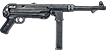</div>
    <h3>MP40</h3>
  </article>
  <article class="mh-weapon-card">
    <div class="mh-weapon-card__meta"><span>#11</span><span>SMG</span></div>
    <div class="mh-weapon-card__art">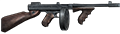</div>
    <h3>Thompson 1928</h3>
  </article>
  <article class="mh-weapon-card">
    <div class="mh-weapon-card__meta"><span>#12</span><span>SMG</span></div>
    <div class="mh-weapon-card__art">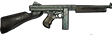</div>
    <h3>M1A1 Thompson</h3>
  </article>
  <article class="mh-weapon-card">
    <div class="mh-weapon-card__meta"><span>#13</span><span>SMG</span></div>
    <div class="mh-weapon-card__art">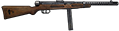</div>
    <h3>Beretta Model 38A</h3>
  </article>
  <article class="mh-weapon-card mh-weapon-card--warning">
    <div class="mh-weapon-card__meta"><span>#14</span><span>Unsafe</span></div>
    <div class="mh-weapon-card__art">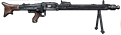</div>
    <h3>MG42</h3><p>Animation is buggy; do not use.</p>
  </article>
  <article class="mh-weapon-card">
    <div class="mh-weapon-card__meta"><span>#15</span><span>Rifle</span></div>
    <div class="mh-weapon-card__art">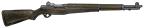</div>
    <h3>M1 Garand</h3>
  </article>
  <article class="mh-weapon-card mh-weapon-card--warning">
    <div class="mh-weapon-card__meta"><span>#16</span><span>Inactive</span></div>
    <div class="mh-weapon-card__art">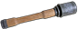</div>
    <h3>Stielhandgranate 24</h3><p>Does not explode.</p>
  </article>
  <article class="mh-weapon-card">
    <div class="mh-weapon-card__meta"><span>#17</span><span>Rifle</span></div>
    <div class="mh-weapon-card__art">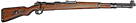</div>
    <h3>Kar98k</h3>
  </article>
  <article class="mh-weapon-card mh-weapon-card--warning">
    <div class="mh-weapon-card__meta"><span>#18</span><span>Missing</span></div>
    <div class="mh-weapon-card__art mh-weapon-card__art--missing">No model preview</div>
    <h3>Mauser 98k Sniper</h3><p>The game model is missing.</p>
  </article>
  <article class="mh-weapon-card">
    <div class="mh-weapon-card__meta"><span>#20</span><span>Throwable</span></div>
    <div class="mh-weapon-card__art">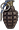</div>
    <h3>Mk II Grenade</h3>
  </article>
  <article class="mh-weapon-card">
    <div class="mh-weapon-card__meta"><span>#21</span><span>Throwable</span></div>
    <div class="mh-weapon-card__art">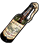</div>
    <h3>Molotov Cocktail</h3>
  </article>
</div>
